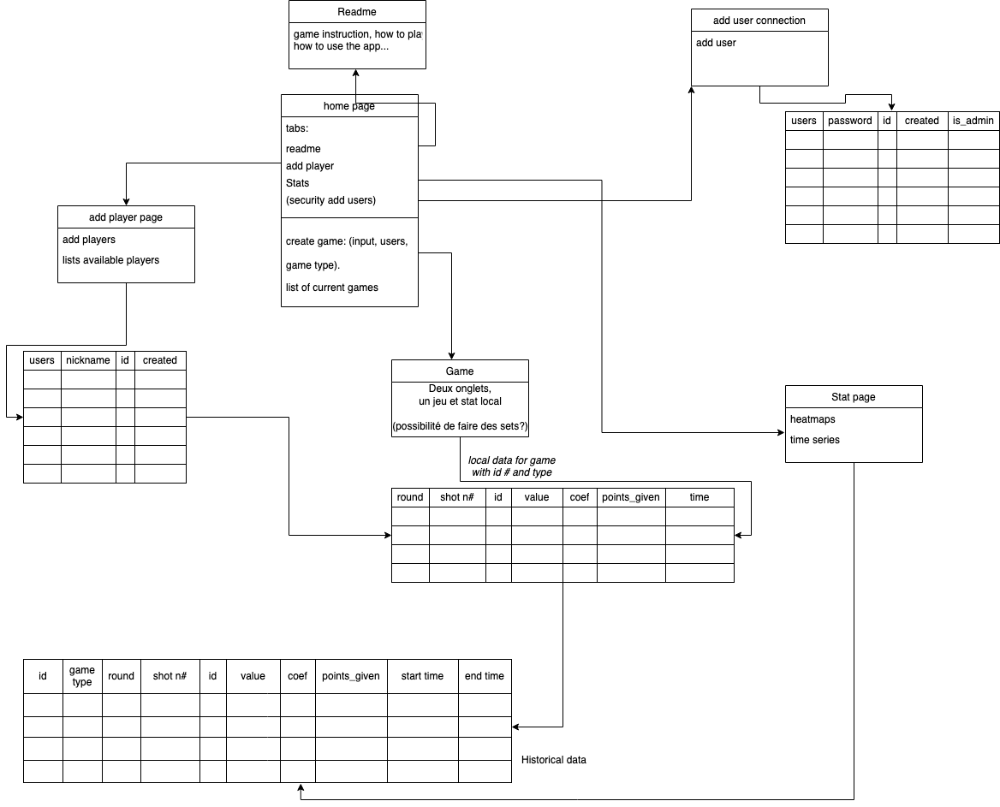

# dart-app
Project to create a collaborative dart score.
Run the project with the command `python app.py`.

## Create geojson

The dart figure is actually a geojson.
You have to generate it thanks to the file `create_dart_geojson.py`.

From the root of the project, `python utils/create_dart_geojson.py` should do the trick.

## Create the geojson mapping dataframe

The mapping is saved under a dataframe, in particular we assign the value, the coefficient and the color to each of the polygons found in the geojson.

From the root of the project, `python utils/dart_mapping.py` should do the trick.

## Over view of the structure
### Version 1

## DNS server

Free on website (freenom)[https://www.freenom.com/en/index.html?lang=en].

# TO DO (pj):
- Maybe add kill and delete button for live games
- Add maybe a load button but for users and there a better saved versions of games
- Add game details
- What to do with the bruno geo_plot file
- error page on bad login authentification